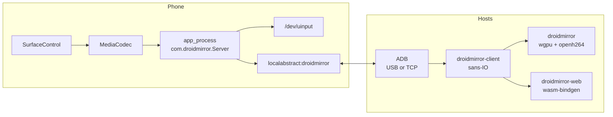
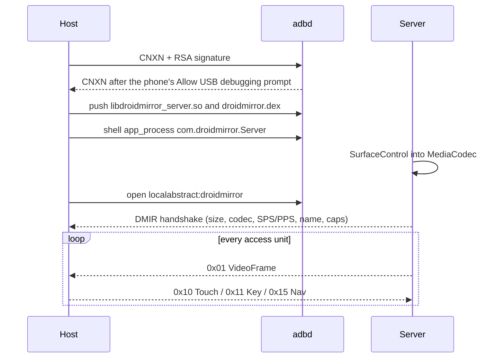
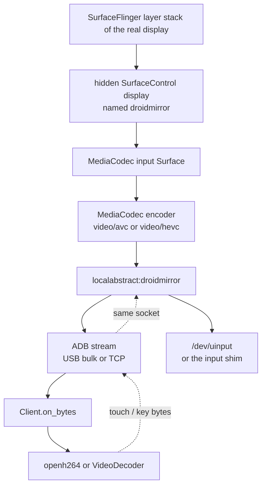

# droidmirror

Android screen mirror and input, written in Rust. A process on the phone encodes the display with the framework `MediaCodec` (not `screenrecord`), streams H.264 over one abstract socket, and injects touch and keys through `/dev/uinput`. The desktop window and the WASM bindings share the same sans-IO core.

USB debugging must be on. The host presents an RSA key; the phone's authorization dialog is never skipped.

## Pieces



| Crate | What it does |
|---|---|
| `droidmirror-proto` | Handshake and framed messages. No I/O. |
| `droidmirror-client` | Demux, control encode, letterbox mapping. Compiles for `wasm32`. |
| `droidmirror-transport` | Native ADB: USB (`nusb`) and TCP. Same 24-byte packet layout as webadb-rs. |
| `droidmirror-server` | `aarch64` capture server, loaded by `app_process`. |
| `droidmirror` | Desktop window. |
| `droidmirror-web` | `wasm-bindgen` face of the client. The host supplies bytes and a decoder. |

## What happens on connect



The desktop client keeps the launch shell open (`exec app_process`) and drains its stderr. Video and control share the abstract socket, so one connection is the whole session.

## How it works

Nothing on the phone is an installed app. The host pushes two files and starts a shell-uid process. That process copies the main display into a hardware encoder, writes the bitstream on one Unix socket, and turns bytes coming back on that same socket into `/dev/uinput` events. The host never parses the bitstream itself until a decoder does. `droidmirror-client` only splits the byte stream into "configure the decoder" and "here is one access unit", and turns a click into a control frame.



### The process is a classloader, not a binary

`MediaCodec` and `SurfaceControl` are Java framework classes. The hidden display methods (`createDisplay`, `setDisplaySurface`, `setDisplayLayerStack`) are reachable from the shell uid, which is what `app_process` runs as. A plain native binary does not have that classloader, so the server is split:

1. `droidmirror.dex` is `com.droidmirror.Server`. `main` reads `--lib=`, calls `System.load` on the `.so`, then `nativeMain(args)`.
2. `libdroidmirror_server.so` exports `Java_com_droidmirror_Server_nativeMain`. That is the Rust server.
3. `droidmirror-server`, if you run it on the device, does not capture anything itself. It `exec`s `/system/bin/app_process64` (or `app_process`) with `CLASSPATH` pointing at the dex beside it, so step 1 happens. The desktop host skips that wrapper and calls `app_process` directly.

Logs go to logcat under the tag `droidmirror` and to stderr. The desktop launch leaves the shell stream open and prints that stderr on the host.

### How a frame is produced

`display_info` asks `DisplayManagerGlobal.getRealDisplay(0)` for width, height, rotation, and the current layer stack. `--max-size N` (0 means off) scales the longer side down, keeping aspect, then rounds both sides down to even pixels. A 1080×2400 phone with `--max-size 720` is captured at 324×720.

`Capture::start` then:

1. `MediaCodec.createEncoderByType("video/avc")`, or `"video/hevc"` when `--codec h265`.
2. Builds a `MediaFormat`: color format `COLOR_FormatSurface` (`0x7F000789`), the requested bitrate, frame rate, an I-frame at least every 1 second, bitrate mode VBR.
3. `configure(..., CONFIGURE_FLAG_ENCODE)` with a null input surface, then `createInputSurface()`. The encoder now owns a `Surface` it will read from.
4. `SurfaceControl.createDisplay("droidmirror", false)` makes a virtual display that is not secure-flagged.
5. In one transaction: `setDisplaySurface` to that encoder surface, `setDisplayProjection` with both rectangles `(0,0,w,h)` and rotation 0, and `setDisplayLayerStack` to the **real** display's layer stack.

That last call is the mirror. SurfaceFlinger already composites the phone UI onto layer stack 0 (or whatever the built-in screen uses). Pointing the virtual display at the same stack makes it composite the same layers into the encoder's surface. There is no `screencap`, no `screenrecord`, and no pixel readback on the CPU. The encoder consumes the surface and emits access units.

`dequeueOutputBuffer` is polled from the server loop. `BUFFER_FLAG_CODEC_CONFIG`, or the `csd-0` / `csd-1` / `csd-2` buffers on the output format, are the SPS and PPS (and VPS for H.265). Those are converted to Annex-B and held back for the handshake; they are not sent as video frames. Later buffers become `0x01` frames. `BUFFER_FLAG_KEY_FRAME` sets the keyframe bit. Presentation time is `presentationTimeUs` from `BufferInfo`. Each buffer is released without rendering (`releaseOutputBuffer(index, false)`), because the picture is going out over the socket, not onto another surface.

The socket is not opened until the encoder and the injector exist. `Listener::bind("droidmirror")` is an `AF_UNIX` `SOCK_STREAM` whose `sun_path[0]` is `0` and the rest is the name `droidmirror`. That is the abstract-namespace address ADB calls `localabstract:droidmirror`. It is not a file under `/dev/socket`. `listen` backlog is 1. `accept` blocks until the host connects, then the fd is set non-blocking.

The handshake is written once, unframed, before any video frame. The host retries the open (about 40 times, 250 ms apart) because `accept` only succeeds after this setup, and the process may still be coming up.

### The server loop

One thread, one client fd. Each turn:

1. `poll` the socket for 5 ms. Any bytes are appended to a control buffer. Complete frames are dispatched: touch, key, text, and scroll go to the injector; `SetEncoding` and `Pause` go to the encoder. Video tags are not expected in this direction.
2. If `SetEncoding` dirtied the bitrate or fps, `setParameters` is applied on the live codec.
3. One `dequeueOutputBuffer(0)` — non-blocking. A frame is encoded as `0x01` and written with `write` until the buffer is gone. A write that would block sleeps 2 ms and retries. A closed socket ends the process.
4. Every 500 ms, display size and rotation are read again. If either changed, the codec and the virtual display are destroyed and created again at the new size, and a `0x02 Configure` (new size and new SPS/PPS) is written. The host must reconfigure its decoder. The uinput axes are not rebuilt; they were opened with a span of `max(width, height, 4096)` so a rotation does not push coordinates outside the axis range.

`Pause` makes `poll` return nothing, so the encoder is not drained, but the socket stays open and input still works. When the host disconnects, the codec is stopped and `SurfaceControl.destroyDisplay` drops the virtual display.

### Why video and input share one socket

Video and input are messages on `localabstract:droidmirror`, so a host can read a chunk, handle it, and write a touch on the same connection. scrcpy can split those across two sockets. This server does not.

The desktop transport is concurrent (`NativeAdb` methods take `&self`, with one reader task demuxing packets onto per-stream channels). It still uses one video socket. A second ADB stream, `shell:exec app_process ...`, only keeps the server process as that shell's child and prints its stderr. It is not the video path. If the decode channel (depth 2) is full, the session calls `request_keyframe_skip` and drops deltas until the next IDR instead of blocking the ADB read.

### What ADB is doing

The host does not talk to the abstract socket directly. It talks to `adbd`, which opens `localabstract:droidmirror` on the device and copies bytes.

Native USB uses `nusb`. The interface is the standard ADB one: class `0xFF`, subclass `0x42`, protocol `0x01`. TCP is the same packet codec over a `tokio` split stream to `ip:5555`, after the phone has been put in `tcpip` mode by some already-authorized connection.

Every ADB message is a 24-byte little-endian header: command, arg0, arg1, payload length, payload checksum (sum of bytes; 0 is accepted), and magic = command XOR `0xFFFFFFFF`. Connect is:

1. Host sends `CNXN`, version `0x01000001`, max payload 1 MiB, banner `host::features=shell_v2,...`.
2. Device sends `AUTH` with a token.
3. Host signs the token with RSA SHA-1 PKCS#1 v1.5 and sends `AUTH` signature (256 bytes).
4. If `adbd` does not already trust the key, it sends the token again. The host then sends `AUTH` with the public key. That is the moment the phone shows **Allow USB debugging?**. The blob is Android's `RSAPublicKey` (n0inv, little-endian modulus, R² mod n, exponent), base64, then ` droidmirror@host` and a NUL. It is not a PKCS#1 DER key. A PKCS#1 blob would not match the keys in the prompt.
5. Device sends `CNXN`. Streams can open.

Key load order: `~/.android/adbkey` if it is a 2048-bit key, else `~/.droidmirror/adbkey`, else generate one and write it there. Reusing `~/.android/adbkey` means a phone that already trusts the host `adb` does not prompt again.

Push is the sync protocol (`SEND` / `DATA` / `DONE`), not a shell redirect. The `.so` is mode `0755`. The dex is `0644`. Shell commands are classic `shell:cmd`, not shell v2. `OPEN localabstract:droidmirror` returns when `adbd` has connected to the listening socket. One reader task on the host demuxes `OKAY` / `WRTE` / `CLSE` onto the local stream id, which is why the shell drain and the video read can run together on desktop.

### The client never sees a socket

`Client` is a buffer. `on_bytes` appends whatever the host just read. Bytes may split a handshake or a frame across reads; the remainder stays in the buffer.

Until the `"DMIR"` prefix has been fully parsed, nothing else is interpreted. A bad magic is an error as soon as 4 bytes are present. A complete handshake emits `DeviceName` and `Configure` (codec, Annex-B csd, width, height) and remembers those dimensions. After that, each `[u32 length][u8 type][payload]` becomes one event. `Configure` replaces the size and csd, which is how rotation reaches the decoder. `VideoFrame` becomes `Frame`. If `request_keyframe_skip` was set, deltas are discarded and the flag clears on the next keyframe. `0x20` audio is ignored. A protocol error is fatal: further `on_bytes` return nothing.

Control methods do not send anything. `touch` runs `map_to_device` and, if the point lands in the picture, returns the `0x10` bytes. The host writes them. The mapping assumes the view is the whole canvas or window (toolbar excluded on desktop) and that the picture is letterboxed inside it, centered, aspect preserved. A point in the black bars returns an empty buffer, so it is not a click at the edge of the screen. Coordinates in the frame are then the encoder's width and height, which are the device pixels after `--max-size`, not necessarily the panel's physical pixels. `rotation` on the client stays 0, because a size change arrives as a new `Configure` with swapped width and height rather than as a separate quarter-turn.

`droidmirror-web` is that same struct with `wasm-bindgen`, for a host that wants to feed bytes in and take control bytes out. `on_bytes` returns `[{kind: "configure"|"frame"|"name"|"error", ...}]`. The codec string on a configure event is a WebCodecs id (`avc1.42E01E` or `hev1.1.6.L93.B0`). No decoder and no ADB types are linked into that crate. `./scripts/build-web.sh` writes the package to `pkg/`.

### What the desktop host does with a frame

The session task calls `on_bytes` and pushes `Configure` / `Frame` onto a sync channel of depth 2. A decode thread runs openh264 (`YUVSource` → RGBA) and hands the bitmap to the winit loop, which uploads it with wgpu. The window's client area minus the 48 dp toolbar is the view rectangle passed to `touch`. If the channel is full, the session calls `request_keyframe_skip` instead of blocking the ADB read. `--record` and `--dump-nals` write the Annex-B bytes as they arrive, before decode. openh264 cannot decode H.265; `--codec h265` still encodes on the device, and the desktop decoder returns an error for those frames.

### What a tap does on the way back

The view coordinates hit `Client::touch` and come out as device pixels in a `0x10` frame. The server's `ControlDemux` feeds `UInput`. The device is a virtual multitouch screen, protocol B: `ABS_MT_SLOT` 0–9, tracking id, position, pressure, touch major, plus `BTN_TOUCH`, `REL_WHEEL`, and `REL_HWHEEL`. The reported name is `droidmirror`, bus `BUS_VIRTUAL`. Android keycodes are translated to Linux `KEY_*` (Android `A` is 29, Linux `KEY_A` is 30, so letters are off by one). Text is ASCII, with shift held for the characters that need it. Scroll is a wheel event at the mapped point.

If `open("/dev/uinput")` fails, the handshake's capability bit 0 stays clear and `ShellInput` runs `input motionevent`, `input keyevent`, `input text`, or `input swipe` instead. That path is a debug fallback. It is slow, and it is not the one the encoder depends on. The picture still works.

Power, Back, Home, Recents, and the volume keys are `0x15`, not ordinary `0x11` keys, so the server can treat them as navigation even when a text field is focused. The desktop toolbar sends a down and an up for the slot under the cursor. Esc and right-click are Back. Printable keys go out as `0x12` text; Ctrl-V reads the host clipboard and does the same.


## Wire format

The first bytes are an unframed handshake. Everything after it is a goauld-style frame: `[u32 LE total_len][u8 type][payload]`, where `total_len` includes the type byte.

```text
handshake
  44 4D 49 52          "DMIR"
  01                   version
  01|02                codec  1 = H.264, 2 = H.265
  ww ww  hh hh         size, little-endian
  nn nn  csd…          Annex-B SPS/PPS (and VPS for H.265)
  nn nn  name…         UTF-8 device name
  caps                 bit0 uinput, bit1 h265, bit2 audio (reserved)
```

| Type | Name | Payload |
|---|---|---|
| `0x01` | VideoFrame | `u64` pts µs, `u8` flags (bit0 = keyframe), `u32` len, Annex-B |
| `0x02` | Configure | new codec, size, csd (rotation or `SetEncoding`) |
| `0x10` | Touch | action, pointer id, `i32` x, `i32` y, `u16` pressure |
| `0x11` | Key | action, Android keycode, meta |
| `0x12` | Text | UTF-8, injected as keys |
| `0x13` | Scroll | x, y, horizontal and vertical as 16.16 fixed (`65536` = 1.0) |
| `0x14` | SetEncoding | bitrate, max fps, max longer side |
| `0x15` | Nav | Back / Home / Recents / Power / volume |
| `0x7F` | Pause | `0` or `1` |

Touch actions: Down `0`, Up `1`, Move `2`, Cancel `3`. Key actions: Down `0`, Up `1`.

Nav keycodes are the Android ones: Back `4`, Home `3`, Recents `187`, Power `26`, Vol+ `24`, Vol− `25`. Meta: Shift `0x1`, Alt `0x2`, Ctrl `0x1000`.

A click in the black bars around the picture is dropped. Inside the picture, the client maps CSS pixels back to device pixels with the same letterbox the window or canvas used to draw the frame. `rotation` is `0` when the handshake width and height already match the oriented video.

## Desktop

Build the phone-side files once (NDK from `ndk.txt`, API 26, plus a JDK so `d8` can emit the dex):

```bash
./scripts/build-server-android.sh
# dist/android-arm64/{libdroidmirror_server.so,droidmirror.dex,droidmirror-server}
```

One phone on USB. If `adb` is already running it keeps the USB interface, and droidmirror uses that server (`127.0.0.1:5037`) instead of opening the device itself. `adb devices` should show the phone as `device`. The first run with a new key shows **Allow USB debugging?** on the phone. The key file is `~/.android/adbkey` when that file is a 2048-bit key, otherwise `~/.droidmirror/adbkey`. Direct USB (no adb server) still uses that key; quit `adb` with `adb kill-server` if you want that path.

```bash
cargo run -p droidmirror --release
```

Two phones need the USB serial (`adb devices` prints it):

```bash
cargo run -p droidmirror --release -- --serial R5CW1234ABCD
```

Wireless, after `adb tcpip 5555` on a phone that is already authorized:

```bash
cargo run -p droidmirror --release -- --tcp 192.168.1.20:5555
```

A slow cable, longer side capped at 720:

```bash
cargo run -p droidmirror --release -- \
  --bitrate 2000000 --max-fps 30 --max-size 720
```

Record the elementary stream (not an MP4) and play it back:

```bash
cargo run -p droidmirror --release -- --record /tmp/mirror.h264
ffplay -f h264 -i /tmp/mirror.h264
```

While bringing the server up, skip the window and print NAL sizes:

```bash
cargo run -p droidmirror -- --dump-nals /tmp/nals.txt
adb shell cat /data/local/tmp/droidmirror/server.log
```

The host pushes both files to `/data/local/tmp/droidmirror/` and runs:

```text
CLASSPATH=/data/local/tmp/droidmirror/droidmirror.dex \
  exec app_process / com.droidmirror.Server \
  --bitrate 8000000 --max-fps 60 --max-size 0 --codec h264 \
  --lib=/data/local/tmp/droidmirror/libdroidmirror_server.so
```

`--server-dir` overrides the directory that holds the `.so` and the dex (default search: next to the binary, `dist/android-arm64`, then the current directory). `--no-control` is view-only. `--codec h265` is encoded on the device; the desktop decoder that is actually built is openh264, so H.265 frames are refused there.

### Window

The bottom strip is six slots: Back, Home, Recents, Power, Vol−, Vol+. Esc and right-click are Back. Typed characters go as text. Ctrl-V pastes the clipboard. Ctrl-H is Home, Ctrl-S is Recents. The scroll wheel maps to `0x13`.

If `/dev/uinput` cannot be created, the handshake clears the uinput bit and a slow `input` binary shim is used instead. Picture still works; taps will feel laggy.

## Tests

No phone required:

```bash
cargo test -p droidmirror-proto -p droidmirror-client \
  -p droidmirror-transport -p droidmirror-server
```

That covers handshake round-trips, chunked demux, letterbox mapping, control encode, a fake adbd (AUTH signature then CNXN), and the uinput event sequence.
